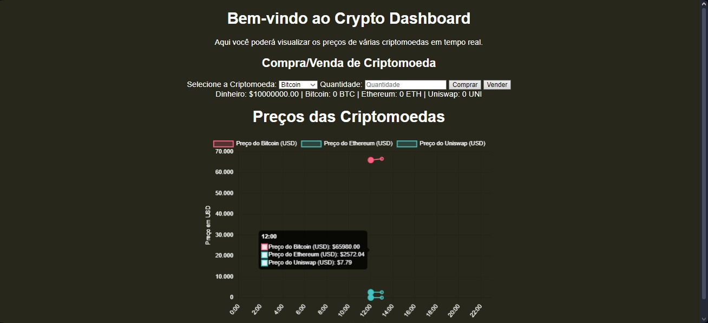
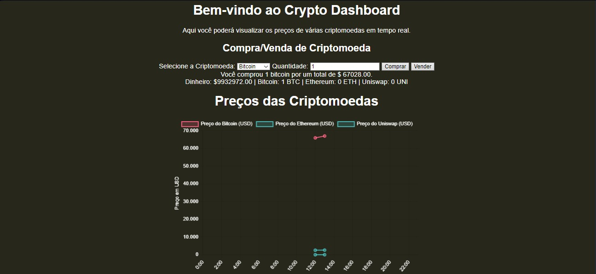
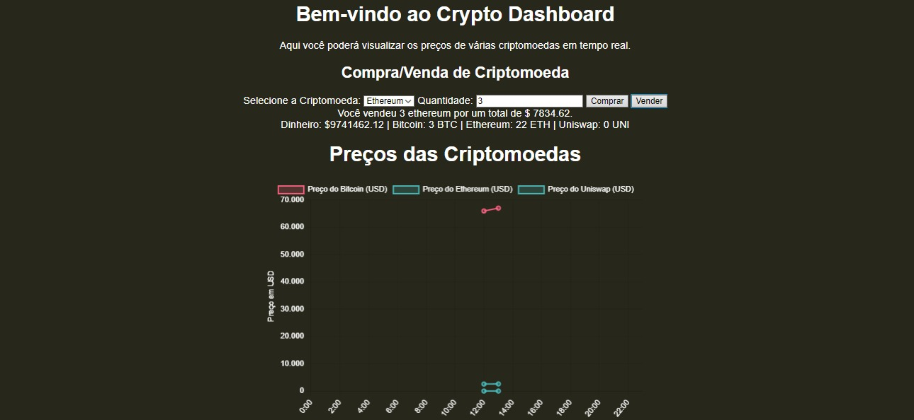
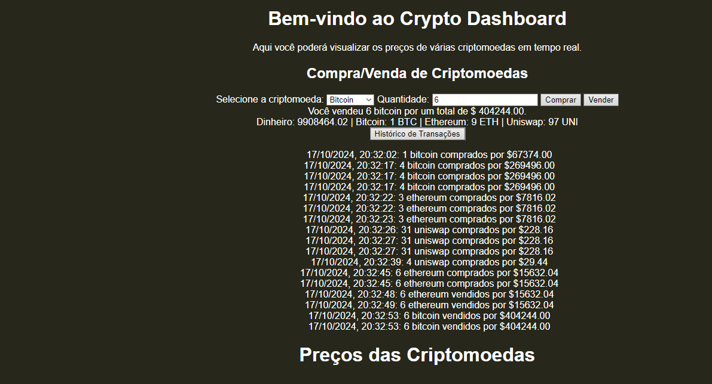
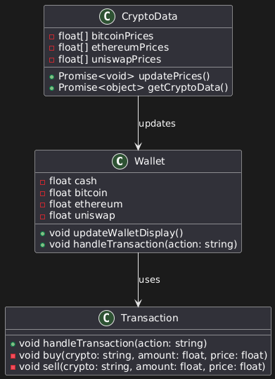
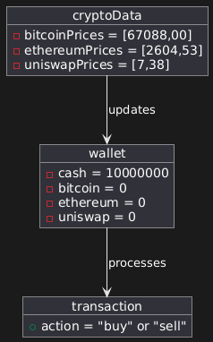
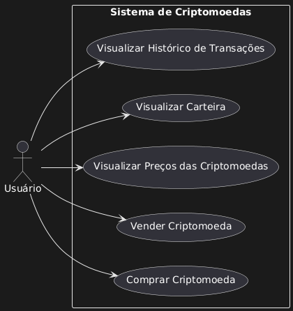
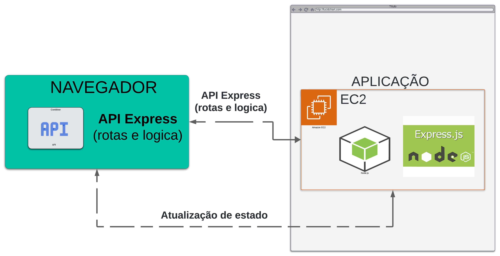

Crypto Dashboard

Prints do site em funcionamento

1. Gráfico de Preços

2. Compra de cripto

3. Venda de cripto

4. histórico de transações

5. diagrama de classe

6. diagrama de objetos

7. diagrama de caso de uso

8. diagrama de arquitetura

Descrição

Este projeto é um dashboard de criptomoedas desenvolvido em Node.js, Express, HTML, CSS e JavaScript. Ele exibe gráficos atualizados com os preços de criptomoedas como Bitcoin, Ethereum e Uniswap, permitindo que os usuários vejam a variação dos preços ao longo do dia.

O objetivo principal do projeto é demonstrar como criar uma aplicação web que busca dados de uma API externa e renderiza esses dados visualmente. O site é apenas para fins de demonstração e não realiza transações reais de compra ou venda de criptomoedas.

#######################################################################################

Funcionalidades

Gráfico de Preços: Mostra a variação de preço das criptomoedas ao longo do dia (de 0h às 23h).

Criptomoedas Monitoradas: Bitcoin (BTC), Ethereum (ETH) e Uniswap (UNI).

Atualizações em Tempo Real: O gráfico atualiza as informações das criptomoedas a cada hora, utilizando a API pública da CoinGecko.

Carteira de Compra e Venda: Os usuários podem simular a compra e venda de criptomoedas diretamente no dashboard. A funcionalidade permite que os usuários escolham a quantia de cada criptomoeda que desejam comprar ou vender e o valor total em USD.

#######################################################################################

Tecnologias Utilizadas

Node.js: Ambiente de execução JavaScript no servidor.

Express: Framework para Node.js, usado para criar o servidor e gerenciar as rotas.

HTML/CSS: Usados para estruturar e estilizar o frontend da aplicação.

JavaScript: Usado no frontend para interagir com a API e renderizar os dados no gráfico.

Chart.js: Biblioteca usada para criar gráficos dinâmicos.

Axios: Utilizado para fazer requisições HTTP à API publica da CoinGecko.

#######################################################################################

Diagrama de Arquitetura

Descrição do Diagrama

User Browser: O navegador do usuário solicita a página inicial e interage com a aplicação.

Frontend (HTML/CSS/JavaScript): O conteúdo da página é servido ao navegador, com gráficos e dados das criptomoedas exibidos ao usuário.

Node.js Server (Express): O servidor Express serve os arquivos estáticos e faz requisições para a API externa de cotação de criptomoedas.

CoinGecko API: API externa utilizada para buscar as cotações das criptomoedas em tempo real.

#######################################################################################

